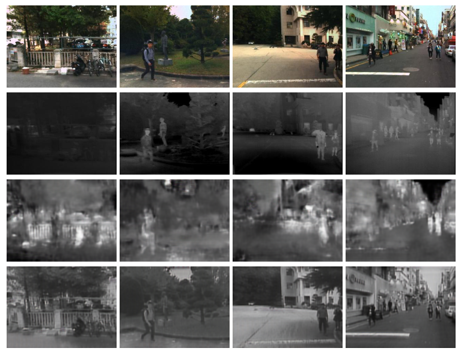

# Image synthesis for action localisation
This project was developed throughout the spring semester of 2022, at Aalborg University. The purpose of this project was to develop three step pipeline to do action localization in thermal domain: 
* Step 1: Style transfer from RGB to thermal domain.
* Step 2: Action localisation in RGB domain.
* Step 3: Domain adaptation for action localisation in thermal domain.

At present work has been made on step 1 and step 2. 
This project was made and tested on [Windows Subsystems for Linux (WSL)](https://docs.microsoft.com/en-us/windows/wsl/install) running Ubuntu 20.04.

The used hardware for training and testing of all the models is a 8 gigabyte NVIDIA GeForce RTX 2070. 

## Dependencies and installation
To install this repository run the following:
```
git clone https://github.com/dleporis/VGIS_841_ImageSynthesis.git
```

In order to run this project, the following dependencies will need to be installed: <br/>
[pytorch and cuda toolkit](https://pytorch.org/get-started/locally/)<br/>
[scipy](https://scipy.org/install/)<br/>
[fvcore](https://github.com/facebookresearch/fvcore) <br/>
[numpy](https://numpy.org/install/)<br/>
[Pillow](https://pillow.readthedocs.io/en/stable/installation.html) <br/>
[visdom](https://pypi.org/project/visdom/) <br/>
[dominate](https://pypi.org/project/dominate/) <br/>
[torchvision](https://pypi.org/project/torchvision/) <br/>
[OpenCV](https://pypi.org/project/opencv-python/) <br/>
[wandb](https://pypi.org/project/wandb/) <br/>

An anaconda environment.yml with all the dependencies has been created for easy installation of this repository: 
```
conda env create -f environment.yml
```

For creation of separate environments (Pix2Pix, CycleGAN and YOWO), run the following command:
```
conda env create -f env/environment_<name>.yml
```

## Style transfer
The style transfer is conducted using Pix2Pix and CycleGAN, using the original implementation of [pytorch-CycleGAN-and-pix2pix](https://github.com/junyanz/pytorch-CycleGAN-and-pix2pix).

Augmentations have been made to [base_options.py](./StyleTransfer/options/base_options.py) (lines 53-61) to allow use of augmentations parameters in the dataloader. <br/>
In [base_dataset.py](./StyleTransfer/data/base_dataset.py) (line 100-102) a transform has been added to augment the images using transform functions from [torchvision](https://pytorch.org/vision/main/transforms.html): [RandomAutocontrast](https://pytorch.org/vision/stable/generated/torchvision.transforms.RandomAutocontrast.html#torchvision.transforms.RandomAutocontrast) and [GaussianBlur](https://pytorch.org/vision/main/generated/torchvision.transforms.GaussianBlur.html#torchvision.transforms.GaussianBlur). 

In [networks.py](./StyleTransfer/models/networks.py) (line 148-154) more network generators has been added to include ResNet18, ResNet32 and ResNet36. 

### Style transfer outputs


Training and testing of the style transfer models (Pix2Pix and CycleGAN) follows the official [pytorch-CycleGAN-and-pix2pix README.md](./StyleTransfer/README.md).

## Action localisation
The action localisation is performed by training a YOWO model following the original implementation of [You Only Watch Once (YOWO)](https://github.com/wei-tim/YOWO)

Due to low available memory on the GPU in use the model was trained on the UCF101-24 dataset using a batch size of 4 for 5 epochs. Installation instructions on YOWO is provided in their [README.md](./ActionLocalisation/README.md).

## Datasets and trained models
We have made the trained style transfer and action localisation models a available to download as a zip file on a google drive [Trained Models](https://drive.google.com/drive/folders/1xBLLkEIWq7PSnG2qWfhP_9U_faygUok5?usp=sharing). 

The datasets used for testing and training CycleGAN and Pix2Pix can be found in a folder on the same google drive [datasets](https://drive.google.com/drive/folders/1xBLLkEIWq7PSnG2qWfhP_9U_faygUok5?usp=sharing).
The datasets contain the following number of images:
|                       	| num of images 	| From datasets                             	| Paired/Unpaired 	|
|-----------------------	|---------------	|-------------------------------------------	|-----------------	|
| kaist-test-set-v2     	| 1617          	| RGB: [KAIST](https://github.com/SoonminHwang/rgbt-ped-detection) <br>Thermal: [KAIST](https://github.com/SoonminHwang/rgbt-ped-detection)             	| Paired          	|
| pix2pix-training-data 	| 4162          	| RGB: [KAIST](https://github.com/SoonminHwang/rgbt-ped-detection) <br>Thermal: [KAIST](https://github.com/SoonminHwang/rgbt-ped-detection)             	| Paired          	|
| cycleGAN-ucfjhmdb     	| 2003          	| RGB: [UCF101-24](https://drive.google.com/file/d/1o2l6nYhd-0DDXGP-IPReBP4y1ffVmGSE/view), [JHMDB](http://jhmdb.is.tue.mpg.de/login)<br>Thermal: [KAIST](https://github.com/SoonminHwang/rgbt-ped-detection), [LTD](https://www.kaggle.com/datasets/ivannikolov/longterm-thermal-drift-dataset)  	| Unpaired        	|
| cycleGAN-kaist        	| 2003          	| RGB:[KAIST](https://github.com/SoonminHwang/rgbt-ped-detection)<br>Thermal: [KAIST](https://github.com/SoonminHwang/rgbt-ped-detection), [LTD](https://www.kaggle.com/datasets/ivannikolov/longterm-thermal-drift-dataset)         	| Unpaired        	|
